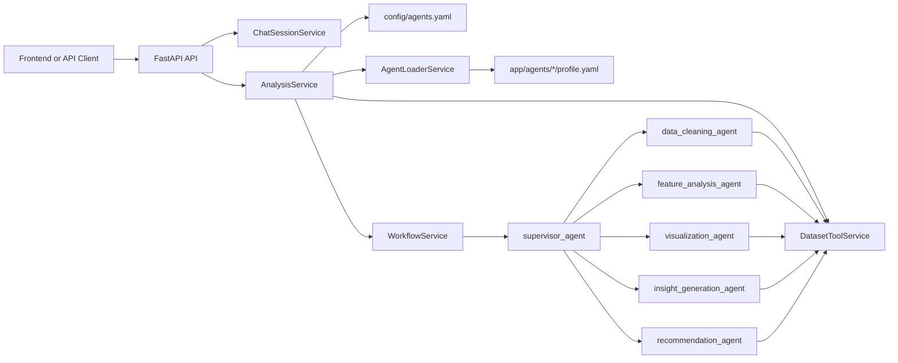

# InsightForge Backend

The backend powers InsightForge's multi-agent analytics workflow. It accepts dataset uploads, stores chat sessions, routes analysis goals to specialist agents, and returns a final business report with agent traces and downloadable artifacts when available.

## What This Service Does

- Exposes a FastAPI API for dataset upload, chat, session history, and artifact download
- Builds a LangGraph workflow with one supervisor agent and multiple specialist agents
- Loads specialist definitions automatically from `app/agents/*/profile.yaml`
- Gives worker agents tool access to inspect dataset schema, statistics, missing values, correlations, outliers, and imputation actions
- Stores chat sessions in MongoDB when configured, with in-memory fallback if MongoDB is unavailable
- Saves uploaded datasets under `data/uploads/<session_id>/`
- Saves cleaned dataset artifacts under the same session folder when the cleaning agent performs imputation

## Backend Architecture



## How Agent Orchestration Works

`config/agents.yaml` defines runtime defaults and the default worker order:

`data_cleaning_agent -> feature_analysis_agent -> visualization_agent -> insight_generation_agent -> recommendation_agent`

That order is only a fallback. In the current implementation the backend runs in supervisor mode:

1. The request arrives through `/api/v1/chat/message`.
2. `AnalysisService` loads `config/agents.yaml`.
3. `AgentLoaderService` merges in all missing agent profiles from `app/agents/*/profile.yaml`.
4. `DatasetToolService` is attached if the session has an uploaded dataset.
5. `WorkflowService` starts at `supervisor_agent`.
6. The supervisor chooses the minimum required specialist subset for the user goal.
7. After each specialist finishes, control returns to the supervisor.
8. The supervisor either dispatches another specialist or finishes early.
9. The supervisor generates the final report with sections for executive summary, findings, risks, and recommendations.

Important implementation detail:

- The supervisor is explicitly told not to run every worker by default.
- If the goal is already satisfied, the workflow can finish immediately.
- If the user asks for a specific kind of output, the supervisor should route only to the matching specialist where possible.

## Specialist Agents and Their Work

### `supervisor_agent`

- Role: orchestration and final synthesis
- Responsibility: understand the user goal, choose the right worker, decide whether more workers are needed, and produce the final consolidated report
- Output style: routing directives during the workflow, then the final business intelligence report

### `data_cleaning_agent`

- Role: data quality specialist
- Responsibility: detect missing values, incomplete fields, outlier-heavy columns, and cleaning risks
- Uses tools such as `missing_values_report`, `sample_rows`, `outlier_report_iqr`, and `dataset_schema`
- Special capability: if the user asks to fill missing values and wants a downloadable cleaned dataset, this agent can call `impute_missing_values`
- Artifact behavior: creates a cleaned CSV or JSON artifact and returns metadata so the frontend can download it

Best suited for prompts like:

- "Find missing values in this dataset"
- "Check data quality issues"
- "Fill missing values and give me the cleaned file"

### `feature_analysis_agent`

- Role: statistical feature analyst
- Responsibility: study feature behavior, column relationships, and high-signal variables
- Uses tools such as `summary_statistics`, `correlation_report`, `dataset_schema`, and `sample_rows`
- Output style: feature-level evidence, statistical summaries, and relationship patterns grounded in the dataset

Best suited for prompts like:

- "Which columns matter most?"
- "Analyze relationships between variables"
- "Show correlations and summary statistics"

### `visualization_agent`

- Role: visualization planner
- Responsibility: translate dataset findings into chart recommendations for decision support
- Uses tool output to propose chart plans grouped by business question
- Special capability: when the user asks for visual or diagram output, this agent includes a valid Mermaid diagram in the response

Important limitation:

- This agent currently returns chart plans and Mermaid diagrams in text form
- It does not generate image files or rendered dashboard assets in the backend

Best suited for prompts like:

- "Suggest charts for this dataset"
- "Create a Mermaid diagram"
- "How should I visualize these results?"

### `insight_generation_agent`

- Role: business insight synthesizer
- Responsibility: convert raw findings into evidence-backed insights, anomalies, and confidence notes
- Uses prior specialist outputs plus dataset tools when needed
- Output style: concise interpretation of patterns without unsupported claims

Best suited for prompts like:

- "What are the main insights?"
- "Highlight anomalies and trends"
- "Explain what this data means"

### `recommendation_agent`

- Role: action-planning specialist
- Responsibility: convert insights into prioritized business actions
- Output style: recommended next steps, rationale, expected impact, and measurable follow-up items

Best suited for prompts like:

- "What should we do next?"
- "Turn these insights into an action plan"
- "Give business recommendations from this analysis"

## Shared Dataset Tools Available to Worker Agents

When a structured dataset is attached to the session, worker agents can use these tools:

| Tool | Purpose |
| --- | --- |
| `dataset_schema` | Returns row count, columns, and inferred column types |
| `sample_rows` | Returns a small sample of dataset rows |
| `missing_values_report` | Returns missing count and percentage per column |
| `summary_statistics` | Returns numeric count, mean, std, min, median, and max |
| `correlation_report` | Returns strongest Pearson correlations between numeric columns |
| `outlier_report_iqr` | Returns outlier counts using IQR fences |
| `impute_missing_values` | Fills missing values, saves a cleaned dataset artifact, and returns artifact metadata |

All worker agents are instructed to use tools whenever numerical or factual evidence is required and to avoid inventing metrics.

## Typical Routing Examples

- Missing value question: supervisor usually routes to `data_cleaning_agent` and can finish after that if the goal is satisfied
- Mermaid or chart request: supervisor can route directly to `visualization_agent`
- Broad analytical question: supervisor may route through `feature_analysis_agent`, then `insight_generation_agent`, then `recommendation_agent`
- Cleaning plus downloadable output: supervisor routes to `data_cleaning_agent`, which may call `impute_missing_values` and attach a cleaned artifact to the session

## API Overview

| Method | Endpoint | Purpose |
| --- | --- | --- |
| `GET` | `/api/v1/health` | Health check |
| `POST` | `/api/v1/chat/session` | Create an empty chat session |
| `GET` | `/api/v1/chat/sessions` | List sessions |
| `GET` | `/api/v1/chat/session/{session_id}` | Fetch one session with messages and artifacts |
| `POST` | `/api/v1/chat/upload` | Upload a dataset and initialize or update a session |
| `POST` | `/api/v1/chat/message` | Send a user request into the agent workflow |
| `GET` | `/api/v1/chat/session/{session_id}/artifacts` | List generated artifacts for a session |
| `GET` | `/api/v1/chat/session/{session_id}/artifacts/{artifact_id}/download` | Download a generated artifact |

The `/api/v1/chat/message` response includes:

- `reply`: final supervisor-written answer
- `agent_outputs`: latest output from each agent that ran
- `agent_trace`: full step-by-step conversation trace, including supervisor dispatch decisions
- `artifacts`: any generated files, such as cleaned datasets
- `messages`: updated session messages

## Supported Dataset Types

- Recommended for full analysis: `.csv`, `.json`
- Upload summary fallback: other text-like files can still be uploaded and summarized

Important limitation:

- Tool-based structured analysis only works reliably for CSV and JSON because dataset loading for worker tools is implemented only for those formats

Default upload limit:

- `MAX_DATASET_UPLOAD_BYTES=5242880` (5 MB)

## Local Setup

### Requirements

- Python 3.11+
- MongoDB access if you want persistent sessions
- An LLM provider configured through environment variables

### Install

Using `pip`:

```powershell
cd backend
python -m venv .venv
.\.venv\Scripts\Activate.ps1
pip install -r requirements.txt
```

Using `uv`:

```powershell
cd backend
uv sync
```

### Environment Variables

Create a local `.env` in `backend/` and configure the values you need:

| Variable | Purpose |
| --- | --- |
| `MONGODB_URL`, `MONGODB_URI`, or `MONGO_URI` | MongoDB connection string for chat persistence |
| `MONGODB_DB_NAME` | MongoDB database name |
| `MONGODB_CHAT_COLLECTION` | Optional collection override for chat sessions |
| `API_HOST` | FastAPI bind host |
| `API_PORT` | FastAPI bind port |
| `API_RELOAD` | Enables auto reload in development |
| `ALLOWED_ORIGINS` | Comma-separated frontend origins for CORS |
| `MAX_DATASET_UPLOAD_BYTES` | Upload size limit |
| `DATA_UPLOAD_DIR` | Root directory for uploaded datasets and artifacts |
| `LOG_LEVEL` | Logging level |
| `LOG_DIR` | Directory for log files |
| `MODEL_PROVIDER` | `gradient`, `digitalocean`, `do`, or `openai` |
| `MODEL_NAME` | Model identifier sent to the LLM provider |
| `MODEL_ACCESS_KEY` | Required for DigitalOcean Gradient-compatible provider |
| `DO_INFERENCE_BASE_URL` | OpenAI-compatible base URL for DigitalOcean inference |
| `OPENAI_API_KEY` | Required when using `MODEL_PROVIDER=openai` |
| `OPENAI_API_BASE` | Optional custom OpenAI-compatible base URL |
| `MODEL_TEMPERATURE` | Optional override for generation temperature |

Do not commit real secrets to version control.

### Run the API

```powershell
cd backend
python main.py serve
```

Or run Uvicorn directly:

```powershell
cd backend
uvicorn app.api:app --reload
```

Default local server:

- `http://127.0.0.1:8000`

## Project Structure

```text
backend/
|-- app/
|   |-- agents/
|   |   |-- supervisor_agent/profile.yaml
|   |   |-- data_cleaning_agent/profile.yaml
|   |   |-- feature_analysis_agent/profile.yaml
|   |   |-- visualization_agent/profile.yaml
|   |   |-- insight_generation_agent/profile.yaml
|   |   `-- recommendation_agent/profile.yaml
|   |-- api.py
|   |-- models/
|   `-- services/
|       |-- analysis_service.py
|       |-- workflow_service.py
|       |-- dataset_tools_service.py
|       |-- dataset_service.py
|       `-- chat_session_service.py
|-- config/
|   `-- agents.yaml
|-- data/
|   `-- uploads/
|-- logs/
|-- main.py
|-- requirements.txt
`-- README.md
```

## How to Add Another Specialist Agent

1. Create a new folder under `app/agents/<agent_name>/`.
2. Add a `profile.yaml` with `name`, `role`, `objective`, `prompt_template`, and `enabled`.
3. If order matters for fallback sequencing, update `config/agents.yaml` edges.
4. If the new specialist needs more evidence sources, extend `DatasetToolService`.
5. Restart the backend.

Because `AgentLoaderService` auto-loads agent profiles, you do not need to hardcode every new worker in the YAML `agents:` list.

## Current Implementation Notes

- `config/agents.yaml` currently keeps `agents: []` because worker definitions are loaded from profile files
- The supervisor pattern is the real control path used by the backend today
- Session history is persisted to MongoDB when available; otherwise it stays in memory for the current process
- Cleaned dataset download is the main generated artifact path implemented today
- Visualization output is recommendation text plus Mermaid, not rendered chart files
